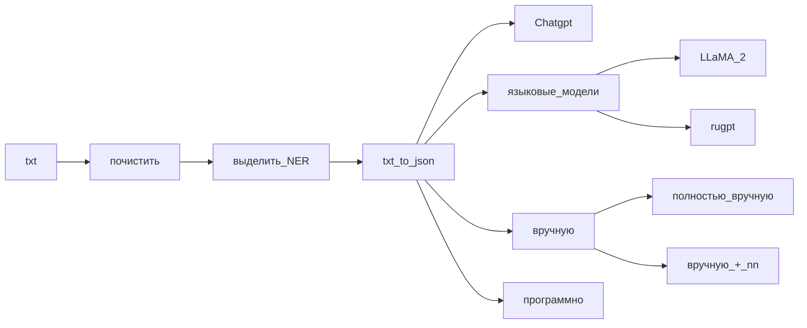

Здесь мы разместим схемы работ.

Пример mermaid диаграмм. Больше примеров у них на сайте. 

```mermaid
flowchart LR
    txt-->почистить;
    почистить-->выделить_NER;
    выделить_NER-->txt_to_json;
    txt_to_json -->Chatgpt;
    txt_to_json --> языковые_модели;
    языковые_модели --> LLaMA_2;
    языковые_модели --> rugpt;
    txt_to_json --> вручную;
    вручную --> полностью_вручную;
    txt_to_json --> программно;
    вручную --> вручную_+_nn;

```
